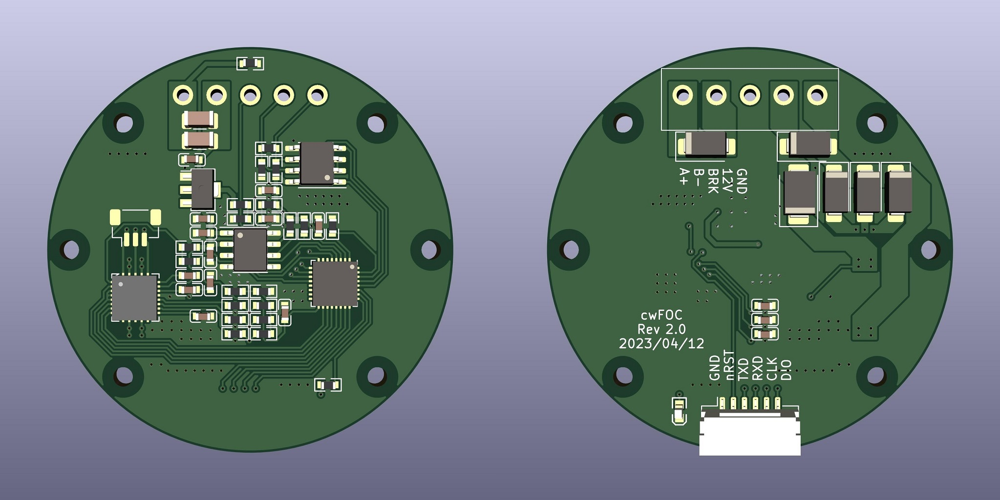

# cwFOC

 

本项目是一个基于芯源半导体 CW32F030K8 的小尺寸 FOC 驱动器

## 控制器进度

- [x] 点灯
- [x] AS5600 驱动
- [x] MP6540 驱动
- [x] SVPWM 开环
- [x] SVPWM 位置闭环
- [ ] 电流采样
- [ ] SVPWM 电流闭环
- [ ] 速度闭环控制
- [ ] 位置闭环控制
- [x] 定点计算优化
- [ ] 通信协议

## 硬件进度

- [x] 原理图设计
- [x] PCB 设计
- [x] PCB 生产
- [ ] PCB 测试

## HMI 进度

TODO

## 快捷链接

[控制器 README](./controller/README.md)

[HMI README](./hmi/README.md)

[硬件 README](./hardware/README.md)

[硬件原理图](./assets/cwFOC_sch.pdf)
